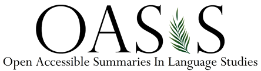

## OASIS

The Open Accessible Summaries In Language Studies (OASIS) initiative aims to make research findings on language learning and teaching available and accessible to a wide audience.

## Project Team

Emma Marsden (University of York; project coordinator)

Sible Andringa (University of Amsterdam)

Laura Collins (Concordia University)

Carrie Jackson (Penn State University)

Rowena Kasprowicz (University of York)

Luke Plonsky (Georgetown University)

 
## Collaborators

The Association for Language Learning

Sible Andringa (Universiteit van Amsterdam)

Marta Anton (Indiana University-Purdue University Indianapolis)

Ian Bauckham CBE (CEO Tenax Schools Trust, Author Teaching Schools Council MFL Pedagogy Report)

Catherine van Beuningen; (University of Applied Sciences Utrecht and Amsterdam University of Applied Sciences)

Heidi Byrnes (Georgetown University)

Terry Lamb (Secretary General, former President of the International Federation of Language Teaching Associations)

Kevin McManus (Penn State University)

Lais de Oliveira Borges (UCL)

Charlene Polio (Michigan State University)

Andrea Revesz (UCL)

Fatma Said (The University of York)

Natasha Tokowicz (University of Pittsburgh)

Tessa Warren (University of Pittsburgh)
 